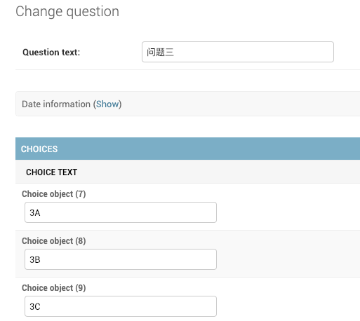
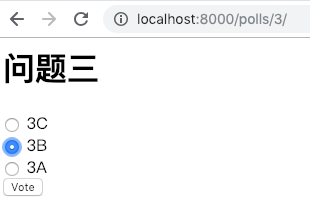

# 第30课：入门 - 完善管理后台（五）

### 增加选项
在之前的课程中，我们通过管理后台创建了三个问题，但它们都还没有选项，现在我们就把这些选项添加上。

通过 admin.site.register(Question) 注册 Question 模型，Django 能够构建一个默认的表单用于展示。

编辑 polls/admin.py，提供3个选项（Choice）字段：
```
from django.contrib import admin
from .models import Choice, Question

class ChoiceInline(admin.TabularInline):
    model = Choice
    extra = 3

class QuestionAdmin(admin.ModelAdmin):
    fieldsets = [
        (None,               {'fields': ['question_text']}),
        ('Date information', {'fields': ['pub_date'], 'classes': ['collapse']}),
    ]
    inlines = [ChoiceInline]

admin.site.register(Question, QuestionAdmin)
```

编辑 mysite/settings.py，将 templates 加入 DIRS 选项会带来更多便利。
```
'DIRS': [os.path.join(BASE_DIR, 'templates')],
```

运行下：$ python manage.py runserver

通过管理后台：http://localhost:8000/admin 创建三个问题的选项，每个问题可有三个选项：

可以这样创建：
```
问题一：
 1A
 1B
 1C
问题二：
 2A
 2B 
 2C
问题三：
 3A
 3B
 3C
```


好了，问题和每个问题的选项都创建好了，现在通过 http://localhost:8000/polls/ 去给每个问题的选项投票。



这个例子算是比较完整的跑起来了，管理后台可调整和完善的地方还有很多，你可以一点点去试试。

配图来自Twitter：@atikix


